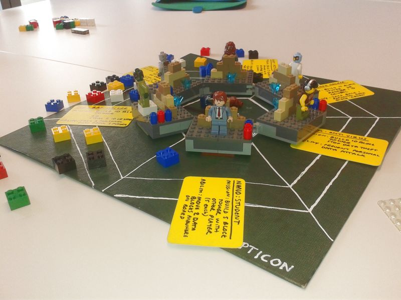

BEE SECURE Panopticon Version 2 - October 2016
=======

## About 

**BEE SECURE‘s Panopticon is a strategy board game based on the topic of “Internet security”.**

As Luxembourg`s national information security competence and excellence centre, BEE SECURE raises awareness for a safe usage of ICT and combines expertise from didactic approaches in non-formal as well as formal education.

Thus, this board game is equally suitable as group activity as well as in the classroom.

Different questions concerning data protection, data control, roles people play and on means of self-protection are raised in a playful context. How can I protect my personal data?

Is someone try to steal my identity? How deep is my (in)sight into the online world? What is my perspective? How can I retain control over my data?

The game can be played with 3-6 players and takes approximately 1 hour.

Each player is on a secret mission which is to be accomplished. Good strategies, ranging from cooperation (e.g. “Activist”) to deception (e.g. “Bad hacker”) are needed to accomplish the mission in order to win the game.

Panopticon is an exciting (Offline) board game, which can be used to foster general internet and media competences and security-oriented online behavior.

Have fun! :) 

## Description

Play Panopticon and become a data controller!

Build your data empire, the tallest tower from which to view the entire internet and control how content and personal data moves. You may have good intentions, or bad ones. Behind the virtual air we breathe are the people who control us – the battle for data and people’s very identities is being fought. What will YOU choose to do?

Game for 3-6 (or more, playing as teams) players. 

## Setting up

You will need the following items for the game:

3-6 players 

A panopticon board 

1 dice 

Power up handhelds: Spanner, Feather, Camera, Binoculars, Dragon's Fire, Megaphone

10 coloured LEGO bricks 2×2 per player in a bag 

6 Player mission cards:

bad hacker, good hacker, trojan, anti-virus, activist, NGO 

## Per player:

1 LEGO mini figure 

1 identity crystal 

6 personal data blocks (LEGO bricks 1×2) 

base board  

3 ability pieces (single square transparent cylinders)

1 mission card

## Preparing the board

Take all of the pieces, except the coloured data pieces out of the bag. Connect the base boards and put them in the centre of the playing board as shown in figure 1. Put all the power up tools in the middle of the board. Each player takes one player mission card without telling anyone what the mission is.

Players prepare their Panopticon bases. Each player picks a mini figure in turn and 3 ability pieces. Take 6 personal data blocks and arrange them into a defensive wall in front of your identity crystal on your base board. Put your mini-figure in front of the wall.

 

## Choosing your data

In turn – pick 10 coloured data pieces without looking from the bag of bits. As you draw out the bits – put them on the board in the following circles within your range – your field of vision. 

first ring: 	1 bits 

second ring:	2 bits 

third ring:	3 bits 

fourth ring:	4 bits

Blue	=  money

Red	=  downloads/consumer products 

Green	=  social media 

Yellow	=  software and tools 

Black	=  black/grey market 

White	=  information 

## Game play

Start of play

Youngest player takes the first turn.

Throw the dice. You need to ‘get’ a block of that colour from the board. You can only look inside your own range at the first circle. If you have that colour – take it &  put it on your base board & put your mini-figure on top of it. This is the start of your Panopticon tower.

Your vision with 1 block on your tower now extends to the second circle within your range.

If you don’t have the right colour and someone else does – you can make a deal. Ask the player with your coloured block in their first circle to give you theirs. The player you ask can give it to you for free, trade theirs for yours or can ask you for a personal data block for it.

If no player has that colour – move onto the next player to your left. Repeat as before.

After throwing the dice, you can choose to play one of your ability pieces instead of taking a colour block or making a trade. 
If you tower gets 2 blocks tall your vision now extends to the third circle. With 3 blocks it extends to 4th (last) circle. Put your mini figure on top as you get taller. You must put your blocks in the order that you get them.

## Leaving the game / loosing control

You can leave the game – or give over control of everything you have if your tower collapses or you choose to knock it down. You must then select which player to give your tower, mini-figure, personal data & id crystals to. If you choose you can stay involved in the game by commenting and making ‘helpful’ suggestions to other players.

If your ID crystal is stolen you carry on playing but are controlled by the thief until end of game or until someone returns it to you.

## Acquiring a tower

If someone gives you control of their data & figure – you need to put the tower blocks & personal data on your own board either on top of your own tower or beside it. You can rearrange your board however you want at this point. Now you have 2 turns every dice throw – one for each mini-figure.

## Winning the game

The winner of the game is the person who reaches their mission first.

## Player Missions

**Bad Hacker** 

**Mission**: Steal 2 identity crystals or be first to build a 10 block tower  

3 ability pieces: Take 1 personal data block from another player. 

**Good Hacker**

**Mission**: Be first to build 10 block tower or wining back 1 stolen id crystal 

3 ability pieces: can take back stolen personal data, and return it to their rightful owner (Sabotages Bad Hacker from winning).

**Anti-Virus**

**Mission**: Stop data theft and build 10 block tower 

3 ability pieces: Prevent a personal data block attack (can play at any time) 

**Trojan**

**Mission**: Steal 2 identity crystals or be first to build 10 block tower. 

3 ability pieces: when a personal data block is taken by a player – you take one too (can play at any time) 

**Activist**

**Mission**: To build 8 block tower with another player who also gets 8 block tower or 10 block tower

3 ability pieces: Take control of bad hacker for 1 turn (play on your turn) 

**NGO**

**Mission**: To build 8 block tower with another player who also gets 8 block tower or 10 block tower

3 ability pieces: Move 2 data blocks from anywhere in the board to new locations (play on your turn) 

## Power ups

Get 3 blocks together of the same colour or 1 block of each colour together (6 in total) and you can power up – choose a power-up tool from the centre of the board and put it in the hands of your mini figure. You can use it on your next turn or on any other turn you choose.

Each power up can only be used **2 times** – then it is returned to centre of board. Power ups have the following powers:

**Spanner** – Rearrange your structure for power up advantage 

**Feather** – for diplomatic purposes. Take back 2 personal data blocks and redistribute 

**Camera** – allows you to take 1 personal data from each player (play on your turn) 

**Binoculars** – takes 1 coloured data block from 2 players (play on your turn) 

**Dragon's Fire** – protects you from a player who wants to take your data (play any time) 

**Megaphone** – take control of 1 player for 1 round (play on your turn) 

## Super power ups

for 5 blocks of the same colour in row: 

**Slave** – steal Identity crystal and take control of one player 

for 4 blocks of same colour in row:

**Rescue** – steal back a stolen ID crystal from another player (can be used once, at any time)

## Credits

BEE SECURE Panopticon game version developed & produced by Chris Pinchen

Thanks to Ana Fernandez Mora, Ishmael Pinchen Fernandez, Debbie Plein, Michelle Schlechter, Raphael Vinot for their contributions

Special thanks to our fantastic testers: Henri Ahola, Sara Ahola, Sarah Brink, Elena Da Silva, Jennifer Gomes, Daria Gospodinova, Ishmael Pinchen Fernandez, Telma Ribeiro Alves

Panopticon game originally conceived by Maf'j Alvarez & Chris Pinchen

Mission cards and player descriptions by Natalie Kane https://ndkane.com/

Board and box design implementation by Ruben Lopez

More information http://panopticongame.lu       Contact: chris@chrispinchen.lu

## License

This work is licensed under the Creative Commons Attribution-ShareAlike 4.0 International License. To view a copy of this license, visit http://creativecommons.org/licenses/by-sa/4.0/ or send a letter to Creative Commons, PO Box 1866, Mountain View, CA 94042, USA.

**WARNING!**

CHOKING HAZARD.

Game contains small parts. Not for children under 3 years old.

BEE SECURE Panopticon
Worum geht‘s?
Panopticon ist ein von BEE SECURE entwickeltes Strategie- und Würfelspiel rund um das Thema „Sicherheit im Internet“. Als staatlich und europäisch getragene luxemburgische Initiative sensibilisiert BEE SECURE für eine sichere Benutzung der Informations- und Kommunikationstechnologien und bringt im Konzept dieses Spiels sowohl Erfahrungen aus dem non-formalen als auch dem formalen Bildungsbereich ein. Das Spiel ist damit gleichermaßen für den Einsatz innerhalb als auch außerhalb des Klassenraums geeignet.
Auf spielerische Art werden hier Fragen zum Datenschutz, zur Rolle unterschiedlicher Akteure im Internet sowie zu Strategien zum eigenen Schutz im Internet aufgeworfen. Wie kann ich meine persönlichen Daten schützen? Versucht jemand, meine Identität zu klauen? Wie tief ist mein eigener Einblick in die Welt des Internets? Wie sehe ich die Dinge? Wie behalte ich die Kontrolle über meine Daten?
Das Spiel kann mit 3-6 Spielern gespielt werden und dauert ca. 1 Stunde. Jeder Spieler erhält eine geheime Mission, die zu erfüllen ist. Hier sind gute Strategien von Kooperation (zum Beispiel „Aktivist“) bis hin zu Täuschung (zum Beispiel „böser Hacker“) gefragt, um das Spiel durch Erfüllen der eigenen Mission zu gewinnen. Panopticon ist ein spannendes (Offline-) Brettspiel, welches dazu genutzt werden kann, generelle Internet- und Medienkompetenzen zu erwerben und ein sicherheitsbedachtes Verhalten im Internet zu fördern.
Viel Spaß! :) 

Beschreibung
Spiele Panopticon und behalte die Kontrolle über deine Daten! Erschaffe dein Daten-Imperium, baue den höchsten Turm und überblicke von dort aus das gesamte Internet! Behalte den Überblick darüber, wie Inhalte und persönliche Daten sich bewegen. Du kannst gute Absichten haben, oder schlechte. Hinter der virtuellen Luft, die wir atmen verstecken sich die Menschen und Mächte, die uns kontrollieren - die Schlacht um Daten und die nackte Identität der Menschen hat schon längst begonnen...Welche Rolle wirst du dabei einnehmen?
Ein Brettspiel für 3-6 Spieler. Spieldauer ca. 1 Stunde.
Spielmaterial
Für das Spiel benötigst du:
3 – 6 Spieler
Ein Panopticon Spielfeld
1 Würfel
„Power Up“-Spielteile: Schraubenschlüssel, Feder, Kamera, Fernrohr, Drachenfeuer, Megafon
10 bunte LEGO Steine 2×2 pro Spieler in einem Säckchen (=Datenstückchen)
6 Missionskarten: Böser Hacker, Guter Hacker, Trojaner, Antivirus, Aktivist, Nichtregierungsorganisation (NGO) 
Pro Spieler:
1 LEGO Spielfigürchen
1 Identitätskristall
6 „persönliche Daten“-Steine für die persönliche Mauer (LEGO Steine 1×2) 
1 Festungsboden
3 Geschicklichkeitsgegenstände (einzelne, quadratische, durchsichtige Zylinder) 
1 Missionskarte
Aufbau des Spielfeldes
Nimm alle Teile außer die bunten LEGO Steine 2x2 (=Datenstückchen) aus der Tasche heraus. Verbinde die 6 Festungsböden und platziere sie im Zentrum des Spielfeldes, wie zu sehen auf Abbildung 1. Lege alle „Power Up“-Spielteile in die Mitte des Spielfeldes und den Würfel an die Seite des Spielbrettes. Jeder Spieler zieht eine Missionskarte und liest sie still. Niemand darf den anderen Mitspielern seine Mission verraten.
Jeder Spieler bereitet seine Panopticon Festung vor. Dabei sucht sich jeder zunächst ein Mini Spielfigürchen aus, und der Reihe nach darf sich jeder 3 Geschicklichkeitsgegenstände nehmen. Baue eine persönliche Mauer aus den 6 „persönliche Daten“-Mauersteinen. Stelle dein Spielfigürchen vor die Mauer deiner Festung.

Abbildung 1 - Aufbau des Spielfeldes
Schnapp dir deine Datenstückchen
Reicht das Säckchen mit den bunten Datenstückchen umher und nehmt euch jeweils, ohne hineinzuschauen, 10 Datenstückchen.
Jeder Spieler verteilt seine Datenstückchen beim Herausnehmen nach und nach in seinem „Blickfeld“ im Panopticon innerhalb seiner 4 Datenbahnen nach folgender Logik (wie auf Abbildung 2 zu sehen):
Erste Datenbahn:		1 Datenstückchen
Zweite Datenbahn:	2 Datenstückchen
Dritte Datenbahn: 	3 Datenstückchen
Vierte Datenbahn:		4 Datenstückchen
Die Farben der Datenstückchen tragen folgende Bedeutungen:

Blau	 = Geld
Rot  	 = Downloads/ Konsumprodukt 
Grün    	 = soziale Medien
Gelb    	 = Software und nützliche Programme
Schwarz   	 = Schwarzmarkt
Weiß   	 = Information 

Abbildung 2 - Aufbau des Spielfeldes mit Datenstückchen
Das Spiel
Und los geht‘s... Der jüngste Spieler darf beginnen. 
Würfele eine Farbe. Du musst dir nun ein Datenstückchen in der gewürfelten Farbe vom Spielfeld ergattern. Du kannst aber zuerst nur in der ersten Datenbahn deines eigenen „Blickfeldes“ nach dem Datenstückchen schauen. Wenn du die passende Farbe hast, nimm das Datenstückchen, setze es auf deine Festung und setze dein Spielfigürchen oben drauf. Damit beginnt der Bau deines Panopticon Turmes.
Deine Sichtweite erweitert sich damit auf die zweite Datenbahn in deinem Blickfeld. Wenn du also das nächste Mal würfelst, kannst du entsprechend aus der zweiten Datenbahn das passende Datenstückchen nehmen.
Wenn du selber nicht die passende Farbe in deiner Datenbahn hast, kannst du in den entsprechenden Datenbahnen der anderen Spieler (deiner Sichtweite entsprechend) danach suchen. Du kannst einem Spieler, der die passende Farbe in der Datenbahn liegen hat, ein Geschäft vorschlagen. Der Spieler kann dir sein Datenstückchen schenken, gegen eines aus deinem Turm eintauschen oder gegen einen Block aus deiner Mauer aus „persönlichen Daten“-Mauersteinen eintauschen.
Wenn kein Spieler die passende Farbe hat oder mit dir ein Tauschgeschäft machen möchte, ist der nächste Spieler an der Reihe (links von dir, Uhrzeigersinn).
Wenn die erste Runde vorbei ist, kannst du nach dem Würfeln zusätzlich einen deiner Geschicklichkeitsgegenstände einsetzen und jegliche Tauschgeschäfte versuchen, die dir dabei helfen, deine geheime Mission zu erfüllen.
Wenn dein Turm zwei Datenstückchen hat, erweitert sich dein Blickfeld auf die dritte Datenbahn. Mit einem Turm aus drei Datenstückchen kannst du entsprechend auf die vierte (äußerste) Datenbahn sehen. Dein Spielfigürchen muss immer auf dem neuen, obersten Datenstückchen des Turmes stehen. Die Datenstückchen müssen in der Reihenfolge, in der du sie bekommst, immer auf das oberste Stück des Turmes (unter die Füße deines Spielfigürchens) gesteckt werden.
Das Spiel verlassen/ die Kontrolle verlieren
Du kannst das Spiel verlassen - oder einem Mitspieler die Kontrolle über alles, das du besitzt, überlassen, falls dein Turm zusammenfällt oder du selber ihn umstößt. Du musst dann entscheiden, welchem Mitspieler du deinen Turm, dein Spielfigürchen, deine „persönlichen Daten“-Mauersteine und deine Identitätskristalle überlässt. 
Wenn du möchtest, kannst du danach trotzdem noch weiterspielen, indem du Kommentare zum Spiel abgibst und anderen Spielern „hilfreiche“ Vorschläge machst.
Wenn dein Identitätskristall geklaut wird, dann spielst du zwar weiter, aber du wirst kontrolliert von dem Dieb bis zum Ende des Spiels oder bis dir jemand den Identitätskristall zurückgibt.
Einen Turm erobern
Wenn dir jemand die Kontrolle über seine Daten und sein Figürchen gibt, dann musst du dessen Turm (die Datenstückchen) und „persönliche Daten“-Mauersteine entweder auf deinem Turm und deiner Mauer anbauen, oder neu auf deiner Festung neben deinem Turm anbauen. An diesem Punkt kannst du deine Festung umbauen, wie es dir beliebt. Außerdem darfst du dann auch zweimal würfeln, je einmal pro Spielfigürchen, das du unter Kontrolle hast.
Das Spiel gewinnen
Wer seine Mission als erster erfüllt gewinnt das Spiel.
Spieler Missionen
Böser Hacker
Mission: Stiehl 2 Identitätskristalle oder baue als Erster einen Turm mit 10 Datenstückchen.
3 Geschicklichkeitsgegenstände: Nimm 1 „persönliche Daten“-Mauerstein eines anderen Spielers.
Guter Hacker
Mission: Baue als erster einen Turm mit 10 Datenstückchen oder erlange einen gestohlenen Identitätskristall zurück.
3 Geschicklichkeitsgegenstände: Du kannst gestohlene „persönliche Daten“-Mauersteine den Händen des Diebes entreißen und dem rechtmäßigen Besitzer zurückgeben (sabotiert den bösen Hacker in seiner Mission).
Anti-Virus
Mission: Stopp Datenklau und baue als erster einen Turm mit 10 Datenstückchen.
3 Geschicklichkeitsgegenstände: Verhindere eine Attacke auf „persönliche Daten“- Mauersteine (kann jederzeit gemacht werden). 
Trojaner
Mission: Stiehl 2 Identitätskristalle oder baue als erster einen Turm mit 10 Datenstückchen.
3 Geschicklichkeitsgegenstände: Wenn ein „persönliche Daten“-Mauerstein eines Spielers von einem anderen Spieler genommen wird, kannst du dir auch einen nehmen (kann jederzeit gemacht werden). 
Aktivist
Mission: Baue einen Turm aus 8 Datenstückchen zusammen mit einem anderen Spieler, der auch 8 Datenstückchen hat oder baue als erster einen Turm mit 10 Datenstückchen.
3 Geschicklichkeitsgegenstände: Kontrolliere den bösen Hacker eine Runde lang (nur spielbar, wenn du an der Reihe bist). 
Nichtregierungsorganisation (NGO)
Mission: Baue einen Turm aus 8 Datenstückchen zusammen mit einem anderen Spieler, der auch 8 Datenstückchen hat oder baue als erster einen Turm mit 10 Datenstückchen.
3 Geschicklichkeitsstückchen: Bewege 2 Datenstückchen aus dem gesamten Spielfeld und platziere sie irgendwo neu (nur spielbar, wenn du an der Reihe bist).
„Power ups“
Sobald du 3 Datenstückchen derselben Farbe hast, kannst du dir eins der extra Werkzeuge zulegen, ein „Power up“. Wähle ein „Power Up“-Werkzeug aus der Mitte des Spielfeldes und stecke es in die Hand deines Spielfigürchens. Du kannst das „Power up“-Werkzeug entweder in der nächsten Runde einsetzen, oder zu jeder beliebigen Runde danach. 
Jedes „Power up“ kann nur zweimal eingesetzt werden. Danach muss es zurück in die Mitte des Spielfeldes gelegt werden. 
Folgendes können die einzelnen „Power ups“ bewirken:
Schraubenschlüssel – Ändere die Reihenfolge der Datenstückchen in deinem Turm, damit du weitere „Power up“ Vorteile genießen kannst. 
Feder – für diplomatische Zwecke. Wähle 2 „persönliche Daten“-Mauerstücke und verteile Sie neu. 
Kamera – erlaubt dir, von jedem Spieler einen „persönlichen Daten“-Mauerstein zu nehmen (nur spielbar, wenn du an der Reihe bist).
Ferngläser – damit kannst du je 1 Datenstückchen von insgesamt 2 Spielern nehmen (nur spielbar, wenn du an der Reihe bist). 
Drachenfeuer – beschützt dich vor Spielern, die versuchen dir Daten zu klauen (kann jederzeit genutzt werden).
Megafon – übernimm eine ganze Runde lang die Kontrolle über einen Spieler (nur spielbar, wenn du an der Reihe bist). 
Super „Power ups“
für 5 Datenstückchen derselben Farbe in einer Reihe: 
Sklave – Stiehl den Identitätskristall eines Spielers und übernimm zusätzlich eine komplette Runde lang die Kontrolle über diesen Spieler

für 4 Datenstückchen derselben Farbe in einer Reihe: 
Rettung – „Stiehl“ den gestohlenen Identitätskristall eines anderen Spielers wieder zurück
Impressum
BEE SECURE Panopticon Spieleversion entwickelt und produziert von: Chris Pinchen
Danke an: Ana Fernandez Mora, Ishmael Pinchen Fernandez, Debbie Plein, Michelle Schlechter, Raphael Vinot for their contributions
Special thanks to our fantastic testers: 
Henri Ahola, Sara Ahola, Sarah Brink, Elena Da Silva, Jennifer Gomes, Daria Gospodinova, Ishmael Pinchen Fernandez, Telma Ribeiro Alves
Originalkonzept des Panopticon Spiels: Maf'j Alvarez & Chris Pinchen
Missionskarten und Spielerbeschreibung: Natalie Kane
Weitere Information http://panopticongame.lu       Konakt: chris@chrispinchen.lu
Lizenzrechtliches

Diese Arbeit ist lizensiert unter einer Creative Commons Attribution-ShareAlike 4.0 International License. Eine Kopie dieser Lizenz finden Sie unter  http://creativecommons.org/licenses/by-sa/4.0/ oder kann per Brief angefragt werden unter Creative Commons, PO Box 1866, Mountain View, CA 94042, USA.

Panopticon Game BEESECURE V1 – March 2016
========================

Last updated by Chris Pinchen on March 28th, 2016

[This game is under creative commons attribution, share-alike licence](http://creativecommons.org/licenses/by-sa/4.0/)

Description
===========

Play Panopticon and become a data controler! build your data empire, the tallest tower from which to view the entire internet and control how content and personal data moves. You may have good intentions, or bad ones. Behind the virtual air we breathe are the people who control us – the battle for data and people’s very identities is being fought. What will YOU choose to do?

Game for 3-6 players. playing time approx 1hr

Setting up
==========

You will need the following items for the game:

3 – 6 players 

A panopticon board 

Spinner – made up of 6 colour positions 

Power up handhelds ( put list here) 

10 coloured 2×2 lego bricks per player in a bag 

6 Player mission cards (bad hacker, good hacker, trojan, anti-virus, activist, NGO ) 

Per player:
-----------
* 1 mini figure 
* 1 identity crystal 
* 6 personal data blocks (1×2 bricks) 
* base board (min 8 x 10 lego board) 
* 3 ability cards (single square brick/cylinders) 

Preparing the board
-------------------
Put all the power up tools in the middle of the board and the spinner on the side of the board. Each player takes one player mission card without telling anyone what the mission is.

Players prepare their Panopticon bases. Each player takes a base board, picks a mini figure in turn and 3 ability cards. Take 6 personal data blocks and arrange them into a defensive wall in front of your identity crystal. Put your mini-figure and put it in front of the wall. Put your base board in the centre of the board so that your character faces outwards

Choosing your data
------------------

In turn – pick 10 coloured data pieces without looking from the bag of bits. As you draw out the bits – put them on the board in the following circles within your range – your field of vision.
* first ring: 1 bit
* second ring: 2 bits 
* third ring: 3 bits 
* fourth ring: 4 bits 

Start of play
=============

Youngest player takes the first turn.
Spin the spinner. You need to ‘get’ a block of that colour from the board. You can only look inside your own range at the first circle. If you have that colour – take it and put it on your base board and put your mini figure on top of it. This is the start of your Panopticon tower.

Your vision with 1 block on your tower now extends to the second circle within your range.
If you don’t have the right colour and someone else does – you can make a deal. Ask the player with your coloured block in their first circle to give you theirs. The player you ask can give it to you for free, trade theirs for yours or can ask you for a personal data block for it.

If no player has that colour – move onto the next player to your left. Repeat as before.
After spinning, you can choose to play one of your ability cards and make any trade you need to help you get closer to your mission.

If you tower gets 2 blocks tall your vision now extends to the third circle. With 3 blocks it extends to 4th (last) circle. Put your mini figure on top as you get taller. You must put your blocks in order that you get them.

Winning the game
================

The winner of the game is the person who reaches their mission first.

Leaving the game / loosing control
----------------------------------

You can leave the game – or give over control of everything you have if your tower collapses or you choose to knock it down. You must then select which player to give your tower, mini-figure, personal data and id crystals to. If you choose you can stay involved in the game by commenting and making ‘helpful’ suggestions to other players.

If your ID crystal is stolen you carry on playing but are controled by the thief until end of game or until someone returns it to you.

Aquiring a tower
----------------

If someone gives you control of their data and figure – you need to put the tower blocks and personal data on your own board either on top of your own tower or beside it. You can rearrange your board however you want at this point. From now on you have 2 turns every spin – one for each minifigure.

* Blue    = money 
* Red     = downloads/consumer products 
* Green   = social media 
* Yellow  = software and tools 
* Black   = black/grey market 
* White   = information 

Player Missions
===============

**Bad Hacker**

Mission: Steal 2 identity crystals or be first to build a 10 block tower or 
3 ability cards: Take 1 other player to give you 1 personal data block. 

**Good Hacker**

Mission: Be first to build 10 block tower or wining back 1 stolen id crystal 
3 ability cards: can take back stolen personal data, and return it to their rightful owner (Sabotages Bad Hacker from winning). 

**Anti-Virus**

Mission: Stop data theft and build 10 block tower 
3 ability cards: Prevent a personal data block attack (can play at any time) 

**Trojan**

Mission: Steal 2 identity crystals or be first to build 10 block tower. 
3 ability cards: when a personal data block is taken by a player – you take one too (can play at any time) 

**Activist**

Mission: To build 5 block with another player who’s mission is also to get 5 blocks 
3 ability cards: Take control of bad hacker for 1 turn (play on your turn) 

**Student**

Mission: To build 5 block with another player who also gets 5 blocks 
3 ability cards: Move 2 data blocks from anywhere in the board to new locations (play on your turn) 

Power ups
=========

Get 3 blocks together of the same colour and you can power up – choose a power-up tool from the centre of the board and put it in the hands of your mini figure. You can use it on your next turn or on any other turn you choose.

Each power up can only be used 2 times – then it is returned to centre of board. Power ups have the following powers:

* Magic wand – Rearrange your structure for power up advantage 
* White wing – for diplomatic purposes. Take back 2 personal data blocks and redistribute 
* Chainsaw – allows you to take 1 personal data from each player (play on your turn) 
* Sword – takes 1 coloured data block from 2 players (play on your turn) 
* Owl – protects you from a player who wants to take your data (play any time) 
* Phaoah helmet – take control of 1 player for 1 round (play on your turn) 

Super power ups
---------------

* for 5 blocks in row: Slave – steal Identity crystal and take control of one player 
* for 4 blocks in row: Rescue – steal back a stolen ID crystal from another player. 
